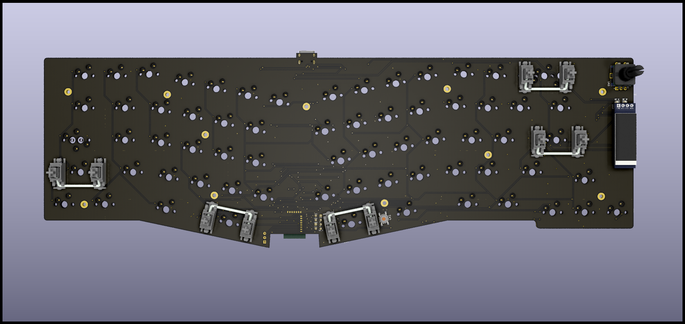
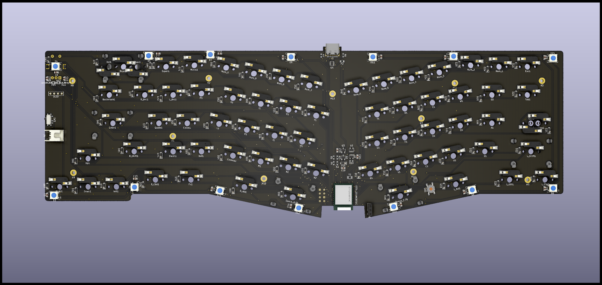
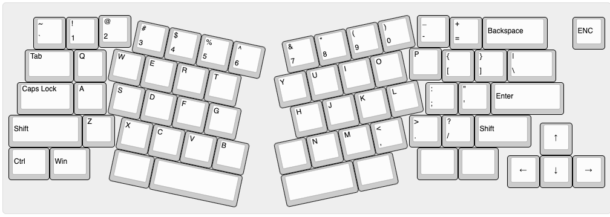
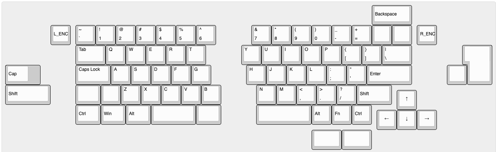
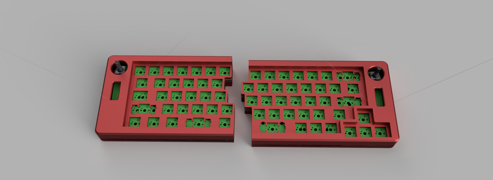
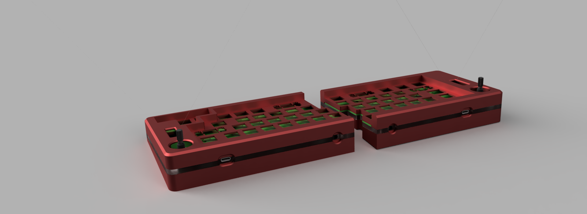
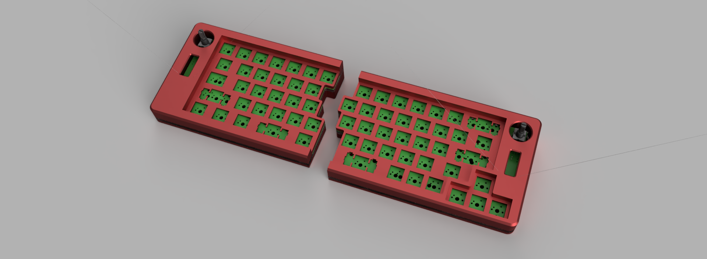

# Marvelous65 Keyboard Series
A 65% wireless hotswap keyboard with Rotary encoder, OLED display and RGB underglow.

## Marvelous65

## Marvelous65 Ergo


## Marvelous65 Split


This keyboard is inspired by luantty2's Candy BLE (https://github.com/luantty2/nRF52840-instruction). When I first saw that I was like "Beautiful! Marvelous!" but that would be nice to make that in 65%. So With no basic knowledge of electronic I brave myself to learn Kicad with the guide of https://wiki.ai03.com/. Basically this is just an nrfmicro 1.4 by Joric embedded in PCB. I also learn some basic Fusion 360 to make a keyboard case and plate.

When I finish designing this, I realize I am not he first one to design this, there is someone in zfrontier forum already done it, it is called Rainbow65, check it out https://www.zfrontier.com/app/flow/e1rpMAd9Nz75.
and there is someone planning an IC for similar layout and feature. 


## Bootloader
Before flashing the firmware, you have to flash the bootloader first. Follow the nrfmicro guide to flash the bootloader https://github.com/joric/nrfmicro/wiki/Bootloader
## Firmware
The firmware will use [ZMK](https://zmkfirmware.dev/). Basic setup ZMK firmware https://zmkfirmware.dev/docs/development/setup.
copy the firmware file to `app/boards/shields`. Edit the keymap or any other feature as you want and build the firmware using the following command 
```bash
west build -p -b nrfmicro_13 -- -DSHIELD=marvelous65_rev2
west build -p -b nrfmicro_13 -- -DSHIELD=marvelous65_ergo
west build -p -b nrfmicro_13 -- -DSHIELD=marvelous65_split_right
west build -p -b nrfmicro_13 -- -DSHIELD=marvelous65_split_left
```

## Features
- Dual mode wireless and wired
- rotary encoder
- oled display 
- rgb underglow
- hotswap (except split version)
- multilayout (except ergo version)

## PCB 
the marvelous65 standard and split version I route it manually. the ergo version I semi auto route it with freerouting. I know a little about electronic, if you have some suggestion or want to coorect the PCB/schematic feel free to make a PR or open an issue.
### Marvelous65


### Marvelous65 Ergo



### Marvelous65 Split


## Layout
### Marvelous65

try it in [KLE](http://www.keyboard-layout-editor.com/##@_name=marvelous65%3B&@_x:3%3B&=~%0A%60&=!%0A1&=%2F@%0A2&=%23%0A3&=$%0A4&=%25%0A5&=%5E%0A6&=%2F&%0A7&=*%0A8&=(%0A9&=)%0A0&=%2F_%0A-&=+%0A%2F=&_a:6&w:2%3B&=Back&_x:0.25%3B&=enc1&_x:1&a:7%3B&=&=%3B&@_x:3&a:4&w:1.5%3B&=Tab&=Q&=W&=E&=R&=T&=Y&=U&=I&=O&=P&=%7B%0A%5B&=%7D%0A%5D&_w:1.5%3B&=%7C%0A%5C&_x:3&a:7&w:1.25&h:2&w2:1.5&h2:1&x2:-0.25%3B&=%3B&@_a:4&w:1.25&w2:1.75&l:true%3B&=Caps%20Lock&_x:1.75&w:1.75%3B&=Caps%20Lock&=A&=S&=D&=F&=G&=H&=J&=K&=L&=%2F:%0A%2F%3B&=%22%0A'&_a:6&w:2.25%3B&=Enter&_x:2&a:7%3B&=%3B&@_w:1.25%3B&=&=&_x:0.75&a:6&w:2.25%3B&=Shift&_a:4%3B&=Z&=X&=C&=V&=B&=N&=M&=%3C%0A,&=%3E%0A.&=%3F%0A%2F%2F&_a:6&w:1.75%3B&=Shift%3B&@_y:-0.75&x:17.25&a:7%3B&=%E2%86%91%3B&@_y:-0.25&x:3&a:6&w:1.25%3B&=Ctrl&_w:1.25%3B&=Win&_w:1.25%3B&=Alt&_a:7&w:6.25%3B&=&_a:6%3B&=Alt&=Fn&=Ctrl%3B&@_y:-0.75&x:16.25&a:7%3B&=%E2%86%90&=%E2%86%93&=%E2%86%92%3B&@_x:6.75&w:2.25%3B&=&_w:1.25%3B&=&_w:2.75%3B&=&_w:1.5%3B&=&_w:1.5%3B&=) (Support ISO, stplit backspace, split spacebar, stepped caps)

### Marvelous65 Ergo

try it in [KLE](http://www.keyboard-layout-editor.com/##@_name=Marvelous65%20Ergo%3B&@_y:0.2&x:2.75%3B&=%2F@%0A2&_x:8.75%3B&=%2F_%0A-%3B&@_y:-0.95&x:0.75%3B&=~%0A%60&=!%0A1&_x:10.75%3B&=+%0A%2F=&_a:6&w:2%3B&=Backspace&_x:0.75%3B&=ENC%3B&@_y:-0.050000000000000044&x:12.25&a:4%3B&=P%3B&@_y:-0.9500000000000002&x:0.5&w:1.5%3B&=Tab&=Q&_x:10.25%3B&=%7B%0A%5B&=%7D%0A%5D&_w:1.5%3B&=%7C%0A%5C%3B&@_x:0.25&w:1.75%3B&=Caps%20Lock&=A&_x:9.75%3B&=%2F:%0A%2F%3B&=%22%0A'&_a:6&w:2.25%3B&=Enter%3B&@_w:2.25%3B&=Shift&_a:4%3B&=Z&_x:9%3B&=%3E%0A.&=%3F%0A%2F%2F&_a:6&w:1.75%3B&=Shift%3B&@_y:-0.75&x:16.25&a:7%3B&=%E2%86%91%3B&@_y:-0.25&a:6&w:1.25%3B&=Ctrl&_w:1.25%3B&=Win&_x:10&a:7&w:1.25%3B&=&_w:1.25%3B&=%3B&@_y:-0.75&x:15.25%3B&=%E2%86%90&=%E2%86%93&=%E2%86%92%3B&@_r:12&rx:3.05&ry:4.35&y:-1.0999999999999996&x:0.20000000000000018&a:4%3B&=X&=C&=V&=B%3B&@_x:0.20000000000000018&a:7&w:1.25%3B&=&_w:2.75%3B&=%3B&@_rx:3.15&ry:3.35&y:-1.1&x:-0.1499999999999999&a:4%3B&=S&=D&=F&=G%3B&@_rx:3.25&ry:2.35&y:-1.1&x:-0.25%3B&=W&=E&=R&=T%3B&@_rx:3.35&ry:1.35&y:-1.1&x:0.3999999999999999%3B&=%23%0A3&=$%0A4&=%25%0A5&=%5E%0A6%3B&@_r:-12&rx:12.1&y:-1.1&x:-3.5999999999999996%3B&=%2F&%0A7&=*%0A8&=(%0A9&=)%0A0%3B&@_rx:12.2&ry:2.35&y:-1.1&x:-3.9499999999999993%3B&=Y&=U&=I&=O%3B&@_rx:12.3&ry:3.35&y:-1.1&x:-3.5500000000000007%3B&=H&=J&=K&=L%3B&@_rx:12.4&ry:4.35&y:-1.0999999999999996&x:-4.15&a:7%3B&=&_a:4%3B&=N&=M&=%3C%0A,%3B&@_rx:12.525&ry:5.5415&y:-1.2915&x:-4.025&a:7&w:2.25%3B&=&_w:1.25%3B&=) (Support split backspace and stepped caps) 

### Marvelous65 Split

try in in [KLE](http://www.keyboard-layout-editor.com/##@_name=Marvelous%20split%3B&@_x:18.25&a:6&w:2%3B&=Backspace%3B&@_x:2.25%3B&=L%2F_ENC&_x:0.25&a:4%3B&=~%0A%60&=!%0A1&=%2F@%0A2&=%23%0A3&=$%0A4&=%25%0A5&=%5E%0A6&_x:1.75%3B&=%2F&%0A7&=*%0A8&=(%0A9&=)%0A0&=%2F_%0A-&=+%0A%2F=&_a:7%3B&=&=&_x:0.25&a:6%3B&=R%2F_ENC%3B&@_x:3.5&a:4&w:1.5%3B&=Tab&=Q&=W&=E&=R&=T&_x:1.75%3B&=Y&=U&=I&=O&=P&=%7B%0A%5B&=%7D%0A%5D&_w:1.5%3B&=%7C%0A%5C&_x:2.75&a:7&w:1.25&h:2&w2:1.5&h2:1&x2:-0.25%3B&=%3B&@_a:6&w:1.25&w2:1.75&l:true%3B&=Cap&_x:2.25&a:4&w:1.75%3B&=Caps%20Lock&=A&=S&=D&=F&=G&_x:1.75%3B&=H&=J&=K&=L&=%2F:%0A%2F%3B&=%22%0A'&_a:6&w:2.25%3B&=Enter&_x:1.75&a:7%3B&=%3B&@_a:6&w:2.25%3B&=Shift&_x:1.25&a:7&w:1.25%3B&=&=&_a:4%3B&=Z&=X&=C&=V&=B&_x:1.75%3B&=N&=M&=%3C%0A,&=%3E%0A.&=%3F%0A%2F%2F&_a:6&w:1.75%3B&=Shift%3B&@_y:-0.75&x:19.5&a:7%3B&=%E2%86%91%3B&@_y:-0.25&x:3.5&a:6&w:1.25%3B&=Ctrl&_w:1.25%3B&=Win&_w:1.25%3B&=Alt&_a:7&w:2.25%3B&=&_w:1.25%3B&=&_x:1.75&w:2.75%3B&=&_a:6%3B&=Alt&=Fn&=Ctrl%3B&@_y:-0.75&x:18.5&a:7%3B&=%E2%86%90&=%E2%86%93&=%E2%86%92%3B&@_x:15.25&w:1.5%3B&=&_w:1.5%3B&=) (Support ISO, stplit backspace, split spacebar, stepped caps)

## Case
All the case is all 3d printed, except the ergo version have acrylic version case. The case have 3 part, top, middle and bottom. the top and bottom using PLA with 20% infill, while the middle use transparent PLA with 100% infill(to diffuse the underglow RGB) I only know some basic 3d knowledge, so if my case is not to your liking you can design your own case and make a PR or keep it to yourself. Here some rendered Image from fusion 360. The case is top mount. Using M2x5/M2x6 threaded insert and M2 screw (I don't remember the exact size, just buy a set of m2 screw.) The plate for marvelous65 and marvelous65 ergo is sandwiched between top case and bottom case, 

### Marvelous65

### Marvelous65 Ergo
#### Acrylic case

#### 3d printed case


### Marvelous65 Split
I am too lazy while designing this one, so I only design ANSI layout case. The plate is integrated to the case, so if you want different layout you want to make another case.




## GIF

https://user-images.githubusercontent.com/18657277/117118259-c4ab1200-adba-11eb-80a2-d7a4a54a5487.mp4

https://user-images.githubusercontent.com/18657277/117118099-8dd4fc00-adba-11eb-8657-396213f3611c.mp4

## BOM
See BOM file for JLCPCB in release page.
also I added IBOM for reference when you will solder it yourself


## Battery
any lipo battery will do, i use 2.4 JST XH connector. it is better to use 3mm thickness battery.

for the pcb [JST XH2.54 Right Angle Pin Header Connector 2P](https://www.aliexpress.com/item/33008489410.html?spm=a2g0o.productlist.0.0.3fc04e79tqtraW&algo_pvid=cc25e59e-b91b-4300-889b-37802f464f64&algo_expid=cc25e59e-b91b-4300-889b-37802f464f64-14&btsid=0bb0620316222031400651818ee7d1&ws_ab_test=searchweb0_0,searchweb201602_,searchweb201603_)
for battery [JST XH 2PIN male](https://www.aliexpress.com/item/32996835431.html?spm=a2g0o.productlist.0.0.52173629BM0hSB&algo_pvid=e2dc7462-9258-4ca2-80d9-968e44934c82&algo_expid=e2dc7462-9258-4ca2-80d9-968e44934c82-4&btsid=0bb0622f16222032556806705ee066&ws_ab_test=searchweb0_0,searchweb201602_,searchweb201603_).
All the battery that I purchase have no connector/socket, so I have to solder it myself. Be carefull when soldering, pay attention to the negative and positive of the battery.


## TODO
- add acrylic case version
- add multi layout case for split version
- fix ergo version plate (misaligned one screw hole)
- marvelous65 ergo 3d printed case split version
- designing logo and silkscreen
- add assembly guide

## Support Me
Help me order prototype PCB for next revision

[](https://ko-fi.com/V7V71MRSU)

## Reference 
- nrfmicro 1.4 https://github.com/joric/nrfmicro/wiki
- nice60 pcb https://github.com/Nicell/nice60
- ZMK firmware https://github.com/zmkfirmware/zmk
